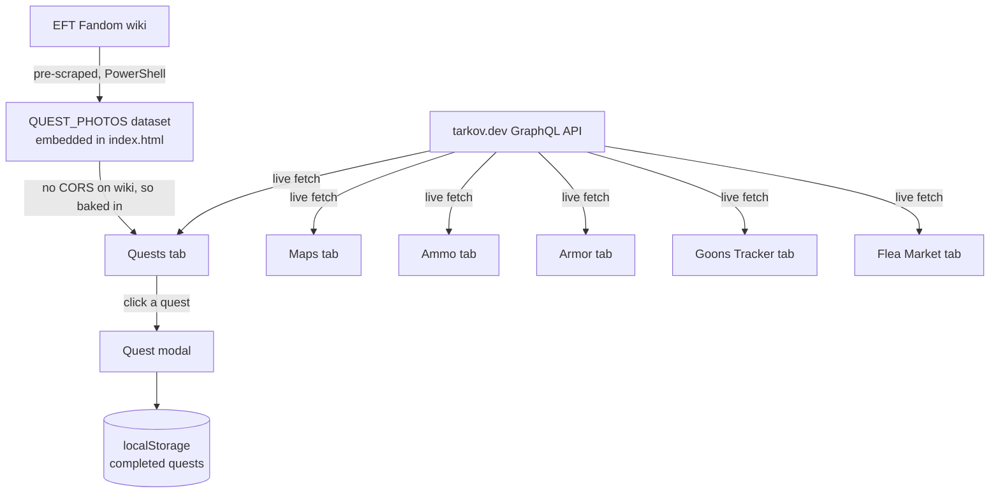
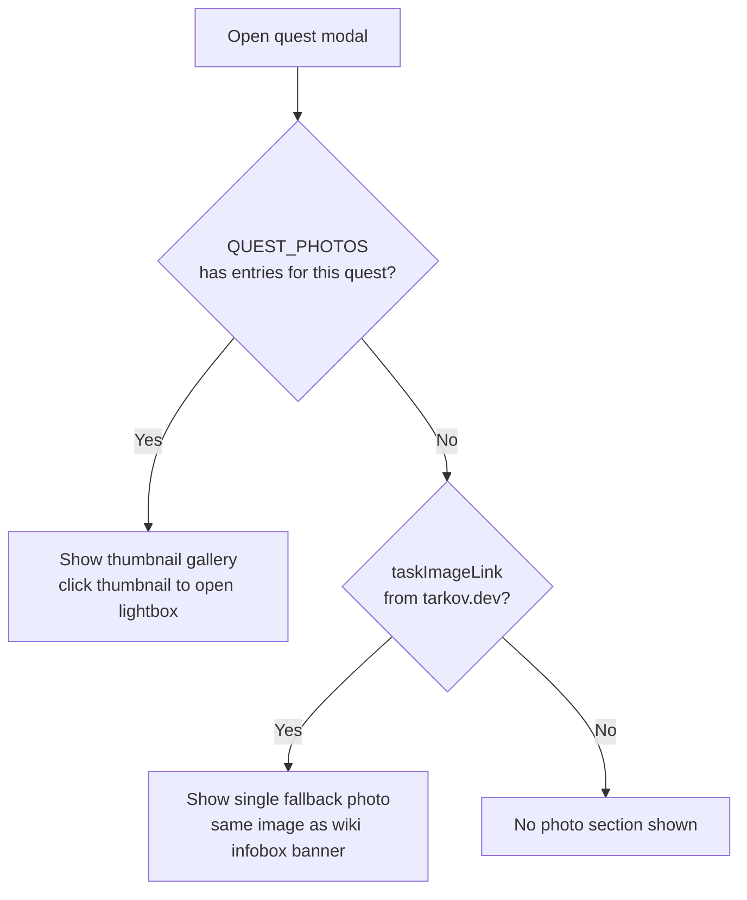
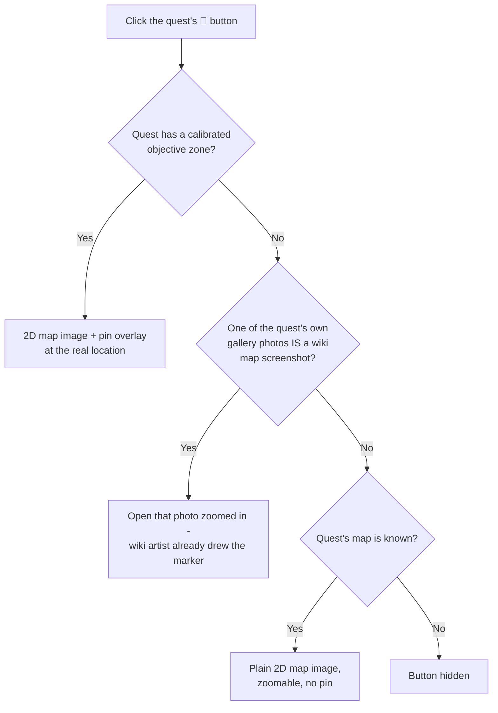

# MohiKov — Escape from Tarkov Companion App

Single-file web app (`index.html`, no build step, no server). All data is fetched live, client-side, from the public tarkov.dev GraphQL API (`https://api.tarkov.dev/graphql`) — nothing is hardcoded.

**Live site:** https://mohib86.github.io/mohikov/
**Repo:** https://github.com/Mohib86/mohikov

## Deploying an update

```bash
git add index.html
git commit -m "describe the change"
git push
```

Live within about a minute, no rebuild step. `gh` CLI auth and the git remote are already configured per-machine — on a new machine, `git clone` this repo and run `gh auth login` once to be able to push again.

## Architecture at a glance



The wiki has no CORS support, so quest photo data can't be fetched live like everything else — it's pre-scraped once via PowerShell and embedded as a static `QUEST_PHOTOS` JS object, same pattern MohiGzone uses for its whole task list.

## Tabs

- **Quests** — `tasks(lang: en)`, grouped by trader, modal with full objective/prereq/wiki details per quest. Progress is a manual checklist saved in the browser's localStorage (per-browser, not synced between people or devices — Tarkov has no player-progress API). Plays a synthesized (not game-ripped) "quest complete" jingle via Web Audio API. A trader portrait strip above the list (fixed order: Prapor, Therapist, Fence, Skier, Peacekeeper, Mechanic, Ragman, Jaeger, Ref, Lightkeeper, BTR Driver) filters quests by trader on click.
- **Maps** — official pre-labeled map images from tarkov.dev's open-source repo (MIT licensed), loaded live from GitHub. Custom click-drag-pan + wheel-zoom (CSS transform-based, not native scroll), with zoom-out always "cover fitting" the box.
- **Ammo** / **Armor** — stats grouped/sorted with item icons, manual refresh button + auto-refresh on a timer. Deliberately does **not** show a "% penetration chance per armor class" table — no verified current formula for that exists, so real numbers (damage, penetration power, etc.) are shown instead of fabricated estimates.
- **Goons Tracker** — uses tarkov.dev's own live `goonReports` query (real community-submitted sightings, not a clone of any third-party tracker's design or database). Shows last known location with a freshness indicator, recent history, and a PvP/PvE toggle.

Header shows a live "Tarkov game time" clock (real in-game time runs 7x real time, UTC+3 offset) — both possible 12-hour-apart day/night cycles are shown since a raid's actual phase isn't knowable until you're in it.

### Quest photo logic



276 of 510 quests have real wiki-gallery photos (location/item screenshots); the rest fall back to tarkov.dev's `taskImageLink` (a mirror of the wiki's infobox banner image, often a render of the handover item itself).

### Show on Map

A single 📍 "Show on Map" button sits next to the "Quest Photos" heading (not one per photo - they all share the same destination anyway). tarkov.dev has no per-screenshot coordinates, so the destination is resolved once per quest, in tiers:



The pin tier needs a per-map calibration in `MAP_TRANSFORMS` (in `index.html`, near `MAP_IMAGES`): two reference points pairing a known extract's real world (x,z) - from `{ maps(lang:en){ extracts{ name position{x y z} } } }` - with that extract's position read by eye as a % of the existing 2D map image. Two points fully determine rotation+scale+offset.

Calibrated: Customs, Woods, Ground Zero, Lighthouse, Shoreline, Streets of Tarkov, Reserve, The Labyrinth.

**Deliberately not calibrated:** Factory (+ Night Factory), Interchange, The Lab. Their 2D map images are "exploded" multi-floor-panel layouts (each floor drawn as a separate inset block, not one continuous top-down plane) — a single global transform would place confidently wrong pins. Quests on those maps safely fall through to the Wiki-map/General tier instead. Terminal and Icebreaker have zero zoned objectives in tarkov.dev's data currently, so there's nothing to calibrate yet either.

### Bugs fixed worth remembering

- Quest gallery `` tags used `loading="lazy"`, but they're inserted into the quest modal's `innerHTML` *before* `#modalOverlay` gets its `.show` class (i.e. while still `display:none`) - some browsers never queue a lazy image for loading if it's hidden at insertion time. Same class of bug as the Maps tab's zero-size-box issue. Removed `loading="lazy"` from the gallery photos since they're a small bounded set shown all at once anyway.
- Fandom's image CDN (`static.wikia.nocookie.net`, what `QUEST_PHOTOS` hotlinks) returns **404 for any image request that carries a Referer header at all** - confirmed by direct testing. Works with no Referer (matches local `file://` testing, or a server-side curl/PowerShell fetch), 404s the instant a real Referer is present, including the live `https://mohib86.github.io/mohikov/` page itself. This is why the gallery worked in local testing but broke on the live site. Fixed with `referrerpolicy="no-referrer"` on every `` that might point at a wiki-hotlinked URL (gallery thumbnails, lightbox, map-pin modal). tarkov.dev's and GitHub's own CDNs don't have this restriction, so `taskImageLink`/`MAP_IMAGES` were never affected.

## Things deliberately *not* done

- No live game-network-traffic sniffing for loot ESP — BattlEye runs in PvE too, and bans are account-wide regardless of mode.
- No scraping/cloning of other trackers' proprietary UI or databases — anywhere this app shows similar info (maps, goon locations), it's pulled from tarkov.dev's own public API or open-source assets instead.
